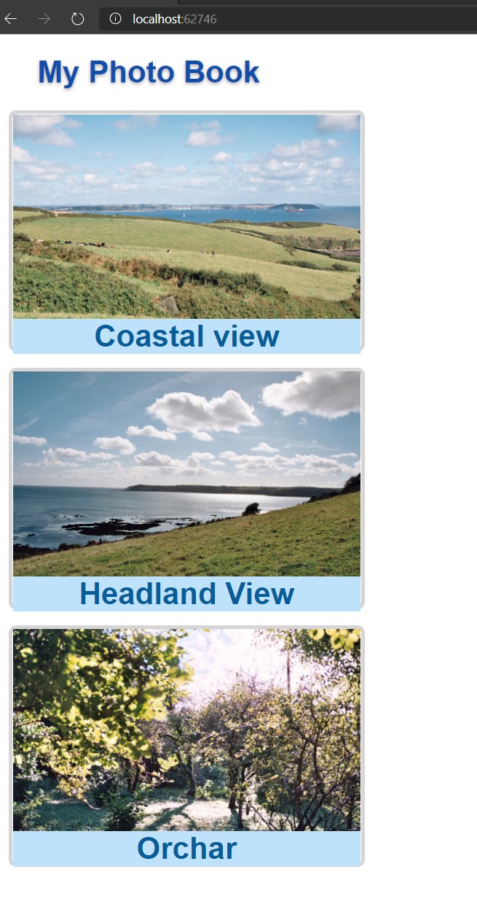

# Tareas del MOC

## Module 9: Client-Side Development

# Lesson 2: Using Task Runners

### Demonstration: How to Use gulp to Compile Sass to CSS

- Instalamos los paquetes
- Creamos un fichero JavaScript **gulpfile.js** con las tareas de copia y compilación
- Creamos el fichero de estilos main.scss
- Incluimos la referencia de este fichero en el index.cshtml
- Ejecutamos

